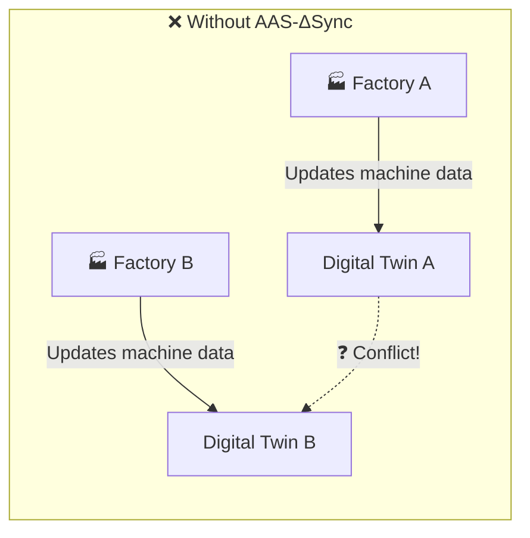
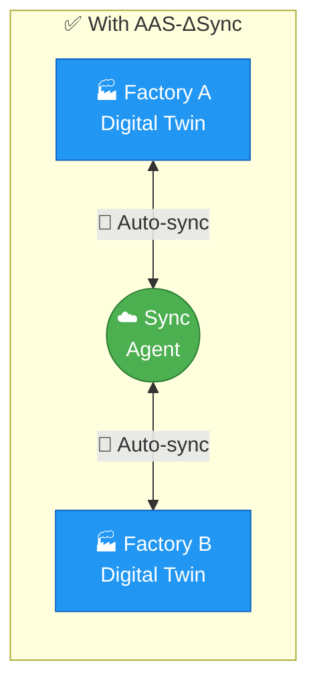
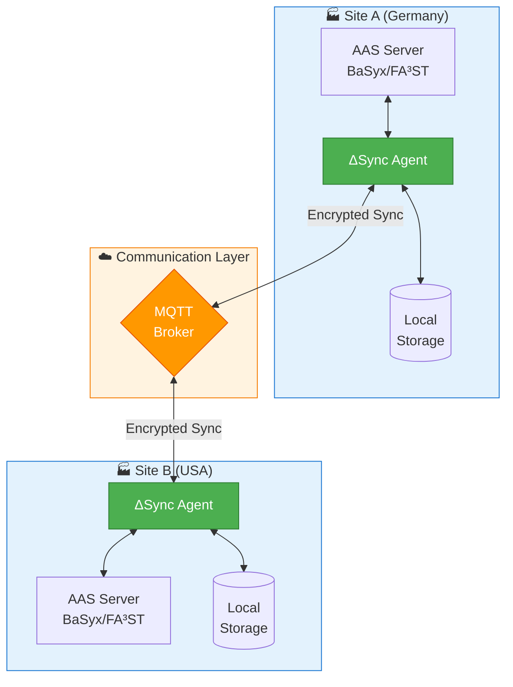
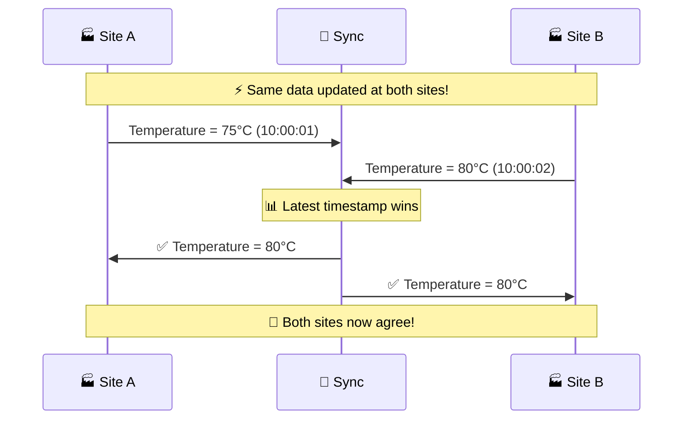

<p align="center">
  
</p>

<h1 align="center">AAS-ΔSync</h1>

<p align="center">
  <strong>Keep your digital twins in sync — even when offline</strong>
</p>

<p align="center">
  <a href="LICENSE"></a>
  <a href="https://www.rust-lang.org/"></a>
  <a href="#"></a>
</p>

---

## 🎯 What Is This?

**AAS-ΔSync** is a synchronization tool for [Asset Administration Shell (AAS)](https://www.plattform-i40.de/IP/Redaktion/EN/Standardartikel/specification-administrationshell.html) digital twins — the Industry 4.0 standard for describing machines, products, and components.

### The Challenge

Imagine you have **two factories** with digital twins of the same machine. When one factory updates the machine's data while offline, how do they stay in sync?



### The Solution

AAS-ΔSync automatically synchronizes changes between sites — **even during network outages** — and intelligently resolves conflicts.



---

## ✨ Key Features

| Feature | What It Means For You |
|---------|----------------------|
| 🌐 **Works Offline** | Keep working even without internet — sync when connection returns |
| 🔄 **Multi-Site Updates** | Multiple locations can update the same data simultaneously |
| 🤝 **Smart Conflict Resolution** | Automatic, deterministic handling of conflicting changes |
| ⚡ **Efficient Transfer** | Only sends the changes, not the entire dataset |
| 🔐 **Secure** | Full HTTPS/TLS support for encrypted communications |

---

## 🏗️ How It Works



**Step by step:**

1. 📝 **You update data** on your local AAS server (temperature, status, etc.)
2. 🎯 **The agent detects the change** instantly via MQTT events
3. 📦 **Only the change is packaged** (not the whole dataset)
4. 📡 **Changes are broadcast** to all connected sites
5. 🔄 **Each site applies changes** automatically with conflict resolution
6. ✅ **All sites converge** to the same state

---

## 🚀 Quick Start

### Prerequisites

- **Docker & Docker Compose** (for running the demo)
- **Rust 1.75+** (only if building from source)

### Try the Demo

```bash
# Clone and enter the repository
git clone https://github.com/hadijannat/aas-deltasync
cd aas-deltasync/examples

# Start the demo (2 sites + MQTT broker)
docker compose up -d

# Run the synchronization demo
./demo.sh
```

The demo creates data on **Site A** and shows it appearing on **Site B** automatically!

### TLS Demo (MQTTS)

Use the TLS-enabled broker and point agents at `mqtts://`:

```bash
./examples/tls/generate-certs.sh
docker compose -f examples/tls/docker-compose.yml up -d
```

---

## 📊 Conflict Resolution Made Simple

When two sites update the same data at the same time, **AAS-ΔSync handles it automatically**:



| Data Type | Resolution Strategy |
|-----------|---------------------|
| Simple values (temperature, status) | Most recent update wins |
| Collections (list of components) | All items merged together |
| Files & documents | Latest version wins |

---

## 🛠️ Technical Overview

<details>
<summary><strong>📦 Project Structure</strong></summary>

| Module | Purpose |
|--------|---------|
| `aas-deltasync-core` | Core sync logic (CRDT, timestamps) |
| `aas-deltasync-adapter-basyx` | Eclipse BaSyx integration |
| `aas-deltasync-adapter-faaast` | FA³ST server integration |
| `aas-deltasync-agent` | Main synchronization service |
| `aas-deltasync-cli` | Command-line tools |

</details>

<details>
<summary><strong>📡 Standards Compliance</strong></summary>

- ✅ **AAS Part 1** (Metamodel): v3.1
- ✅ **AAS Part 2** (API): v3.1
- ✅ **Eclipse BaSyx**: v2.x MQTT eventing
- ✅ **FA³ST Service**: v1.x (HTTPS-only)

</details>

<details>
<summary><strong>⚙️ Configuration Example</strong></summary>

```yaml
agent:
  id: "site-a-agent"
  
adapters:
  basyx:
    aas_repo_url: "http://basyx-aas-repo:8081"
    sm_repo_url: "http://basyx-sm-repo:8082"
    mqtt_broker: "tcp://mosquitto:1883"
    mqtt_ca_path: "/certs/ca.crt"

persistence:
  type: sqlite
  path: "/data/deltasync.db"
```

</details>

---

## 📚 Learn More

- 📖 [CRDT Mapping Design](docs/design/crdt-mapping.md) — How conflict resolution works
- 📄 [CONTRIBUTING.md](CONTRIBUTING.md) — How to contribute
- 📋 [CHANGELOG.md](CHANGELOG.md) — What's new

---

## 📜 Citation

```bibtex
@software{aas_deltasync,
  title = {AAS-ΔSync: Offline-First Multi-Master Synchronization for Asset Administration Shell Digital Twins},
  author = {Jannatabadi, Hadi},
  year = {2025},
  url = {https://github.com/hadijannat/aas-deltasync}
}
```

---

<p align="center">
  <strong>Apache-2.0 License</strong> · Made with 🦀 Rust
</p>
